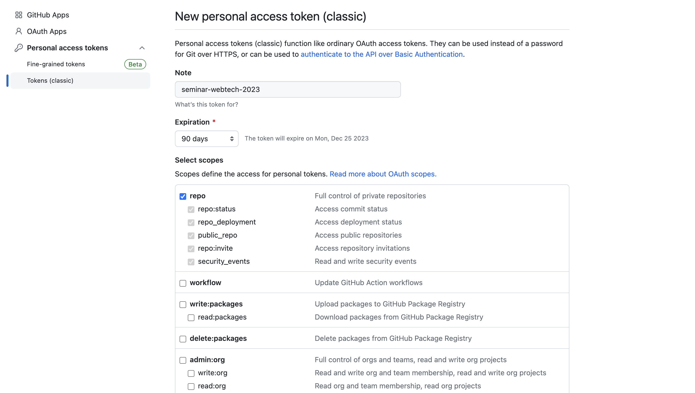
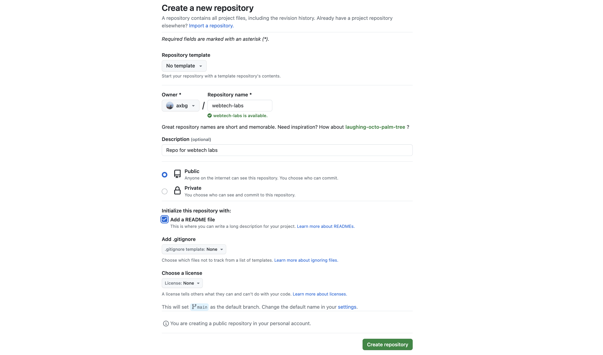

# Introducere: Git & JavaScript

## 1. GitHub
- Git, software-ul care stă la baza GitHub și a oricărei altă platformă de acest tip, este un tool inițiat de Linus Torvalds în 2005 ce permite programatorilor să își versioneze codul și să colaboreze mai ușor

- Git are o terminologie specifică, cele mai importante concepte fiind
    - Repository - un director care conține toate fișierele unui proiect, precum și tot istoricul acestora 

    - Commit - o reprezentare (snapshot) ale unor modificări aduse unor fișiere ce este gestionată atomic 
        - fiecare commit poate fi însoțit de către un mesaj care să descrie, pe scurt, modificările ce au fost introduse 

    - Staged - toate fișierele ce vor fi incluse în commit-ul următor
    
    - Branch - o ramificație a versiunii de bază a repository-ului ce permite adăugarea de functionalități noi care pot fi ulterior reintegrate
        - orice repository are un branch principal care poartă, în general, numele de "main" sau "master"
    
    - Clone - o copie a unui repository

    - Remote - o versiune a unui repository aflată pe un server, în general fiind considerată versiunea principală a acelui repository
    
    - Pull - activitatea de actualizare a copiei locale a unui repository cu commit-urile noi din remote

    - Push - activitatea de actualizare a repository-ului remote cu noile commit-uri definite local

    - Conflict - o situație care apare atunci când aceeași secțiune a unui fișier a fost modificată în același timp de către mai multe persoane

    - Merge - mecanismul prin care modificările făcute într-un branch pot fi transferate în alt branch

- Pentru a aplica aceste concepte, git folosește o serie de comenzi, cele mai importante fiind
    - git clone - clonarea unui repository

    - git config - permite configurarea preferințelor locale
    
    - git branch - listarea tuturor branch-urilor dintr-un repository
    
    - git checkout - navigarea de la un branch la altul în cadrul unui repository
        - folosit împreună cu parametrul "-b" pentru crearea unui branch nou
    
    - git fetch - descarcă ultimele informații din remote, fără a descărca, însă, codul
    
    - git pull - descarcă ultimele informații din remote, împreună cu modificările codului
    
    - git add - adaugă fișierele selectate în lista de fișiere care vor fi incluse în următorul commit
    
    - git status - afișează fișierele care vor fi incluse în următorul commit, precum și toate fișierele modificate
    
    - git commit - creează un commit nou ce va include toate modificările adăugate anterior
        - folosit de cele mai multe ori împreună cu parametrul -m (message) care asociază commit-ului creat un mesaj 
    
    - git push - salvează commit-urile locale în remote

    - git log - vizualizarea istoricului commit-urilor din branch-ul curent

- Git este un tool foarte puternic, foarte complex și foarte important pentru orice programator, motiv pentru care aprofundarea conceptelor sunt o necesitate pentru colaborarea într-o echipă de dezvoltare
    - Recomandare: tutorial mai complex, cu ilustrații: https://www.atlassian.com/git/tutorials/what-is-version-control
    - Recomandare: cheat sheet care va fi foarte util la început: https://www.atlassian.com/git/tutorials/atlassian-git-cheatsheet

### 1.1. Creare cont [GitHub](https://github.com)
- Pentru început, o să creăm un cont pe [GitHub](https://github.com) pe care îl vom folosi pe tot parcursul semestrului pentru:
    - Exerciții la seminar
    - Teme
    - Proiect
    - (orice altceva atunci când avem și cod 😇)

- O să generăm un token care ne va permite să ne conectăm la contul de GitHub și să descărcăm repository-urile private și să facem actualizări proiectelor existente
    - accesăm: https://github.com/settings/tokens
    - click pe "Generate New Token"
    - click pe "Generate New Token (classic)"
    - introducem un nume pentru noul token
    - selectăm "Expiration 90 days"
    - selectăm checkbox-ul "repo"
        
    - după generare, salvăm token-ul generat
        - acesta poate fi regenerat, însă nu poate fi accesat în mod direct după acest pas

### 1.2. Crearea unui repository
- Accesăm https://github.com/new pentru crearea unui nou repository
- Completăm câmpurile:
    - Repository name
    - Description
    - Bifăm opțiunea "Public"
    - Bifăm opțiunea "Add a README file"
        
- Finalizăm creare repository-ului

### 1.3. Instalare Git
- Accesăm https://git-scm.com/downloads și descărcăm versiunea de Git specifică sistemului de operare folosit

### 1.4. Clonarea repository-ului
- După instalarea Git, vom accesa terminalul și vom executa comanda de clonare a repository-ului și vom înlocui valorile aflate între parantezele unghiulare cu numele contului, respectiv cu numele repo-ului pe care vrem să îl clonăm
    ```bash
    git clone https://github.com/<<username>>/<<repo>>.git
    # ex: git clone https://github.com/axbg/webtech-23.git
    ```
- Pentru username vom folosi username-ul contului, iar pentru parola token-ul generat la pasul 2

### 1.5. Versionarea codului
- Accesăm fișierul "README.md" din repository-ul clonat local și adăugăm o modificare

- Utilizând conceptele și comenzile prezentate la început, vom crea un commit și vom salva modificarea în repository-ul remote
    ```bash
    git add .
    git status
    git commit -m "Updated README.md"
    git log
    git push
    ```

- Accesăm în repository-ul în browser și observăm că modificările aduse fișierului README au fost salvate în repository-ul remote


## 2. JavaScript
- Deși JavaScript este un limbaj recunoscut pentru utilizarea în aplicațiile front-end, în cadrul seminarului vom folosi JavaScript atât pentru a scrie front-end, cât și pentru a scrie back-end

- În cadrul unei aplicații web, front-end-ul definește tot ceea ce se poate vedea pe dispozitivul utilizatorului (interfața grafică), iar back-end-ul definește toate procesele logice care implementează diverse functionalități și care rulează pe un server


### 2.1 JavaScript pe client
- Toate browserele dispun de un runtime  JavaScript ce va executa codul destinat dispozitivelor de tip client

- Acest cod, deși este descărcat inițial de pe server, va fi executat abia după ce va fi descărcat și încărcat în browser

- Cea mai rapidă modalitate de a rula cod JavaScript este de a folosi consola unui browser

- Similar, putem crea un fișier de tipul HTML în care vom include o secțiune <script></script> în interiorul căreia vom putea scrie cod JavaScript ce va fi executat de către browser atunci când va încărca fișierul HTML 

### 2.2 JavaScript pe server
- JavaScript poate rula pe server cu ajutorul node.js, un runtime de JavaScript lansat în anul 2009 ce a schimbat perspectiva asupra limbajului
    - Pentru a putea fi utilizat, node.js trebuie mai întâi instalat: https://nodejs.org/en/download 

- Creăm un fișier "main.js" în care vom adăuga linia de cod: 
    ```js
    console.log("hello node");
    ```

- În terminal, accesăm directorul în care a fost creat fișierul și rulăm comanda:
    ```bash
    node main.js
    ```

- Fiind folosit pentru dezvoltarea de aplicații back-end, node.js vine cu multiple funcționalități care simplifică dezvoltarea în regim server

- În fișierul creat anterior, înlocuim linia de cod cu secvența de mai jos și o vom executa folosind node:
    ```js
    const http = require("http");

    http
        .createServer((req, res) => {
                res.write("Hello web!");
                res.end();
        }).listen(8080);
    ```

- După executare, accesăm adresa http://localhost:8080 în browser, unde vom putea observa mesajul definit anterior
